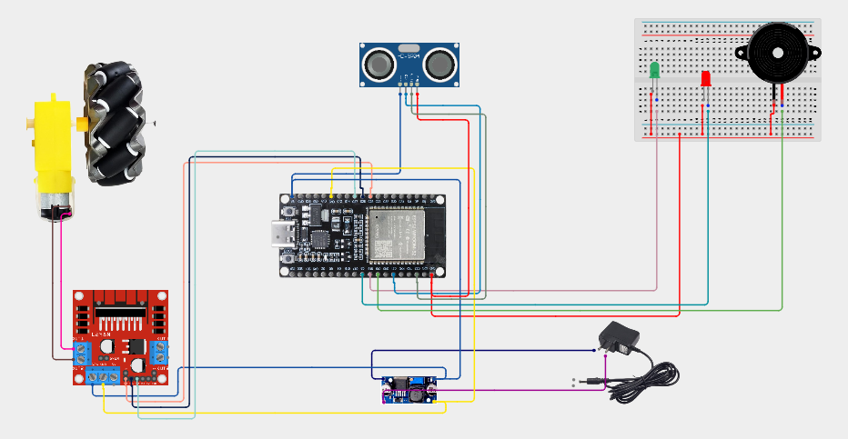

# ESP32 Obstacle Speed Control

## 📌 Project Overview

This project demonstrates an **automatic obstacle detection and motor speed control system** using an ESP32.

An **HC-SR04 ultrasonic sensor** measures the distance between the vehicle and an obstacle. Based on the detected distance, the ESP32 automatically adjusts the motor speed using **PWM**.

The system operates in three conditions:

- **Distance > 20 cm** → Motor runs at full speed
- **10–20 cm** → Motor speed gradually decreases as the obstacle gets closer
- **Distance < 10 cm** → Motor stops and the buzzer and red LED are activated

A **green LED** indicates a clear path, while the **red LED and buzzer** indicate a critical obstacle condition.

---

## 🔧 Components Required

- ESP32 Development Board
- HC-SR04 Ultrasonic Sensor
- L298N Motor Driver
- DC Motor
- Green LED
- Red LED
- Buzzer
- Current-Limiting Resistors
- Jumper Wires
- Power Supply

---

## 🔌 Pin Configuration

| Component | ESP32 Pin |
|---|---:|
| Ultrasonic TRIG | GPIO 21 |
| Ultrasonic ECHO | GPIO 22 |
| L298N ENA | GPIO 25 |
| L298N IN1 | GPIO 26 |
| L298N IN2 | GPIO 27 |
| Green LED | GPIO 18 |
| Red LED | GPIO 5 |
| Buzzer | GPIO 19 |

---

## 🔌 Circuit Diagram

---

## ⚙️ Working Principle

The ultrasonic sensor sends a short trigger pulse and measures the time taken for the echo to return.

The distance is calculated using:

`Distance = Duration × 0.0343 / 2`

The ESP32 then compares the measured distance with predefined safety ranges.

### 🟢 Distance Above 20 cm

When the path is clear:

- Motor runs at **full PWM**
- PWM value = **255**
- Green LED = **ON**
- Red LED = **OFF**
- Buzzer = **OFF**

Serial Monitor displays:

`PATH CLEAR - FULL SPEED`

### 🟡 Distance Between 10 cm and 20 cm

When an obstacle is detected within 10–20 cm:

- Motor speed is automatically reduced
- PWM value is calculated according to the distance
- Green LED remains **ON**
- Red LED remains **OFF**
- Buzzer remains **OFF**

The closer the obstacle gets, the lower the motor speed becomes.

The speed is calculated using:

`speed = map(distance, 10, 20, 0, 255)`

A minimum PWM value of **60** is maintained to help prevent the motor from starting with insufficient torque.

### 🔴 Distance Below 10 cm

When the obstacle is closer than 10 cm:

- Motor stops
- PWM value = **0**
- Green LED = **OFF**
- Red LED = **ON**
- Buzzer = **ON**

Serial Monitor displays:

`!!! STOP !!!`

`Obstacle below 10 cm`

---

## 🎛️ ESP32 PWM Configuration

The project uses ESP32 PWM to control the motor speed.

| Parameter | Value |
|---|---:|
| PWM Channel | 0 |
| PWM Frequency | 1000 Hz |
| PWM Resolution | 8-bit |
| PWM Range | 0–255 |
| Maximum Speed | 255 |
| Stop | 0 |

With **8-bit PWM resolution**, the PWM value ranges from **0 to 255**.

> **Higher PWM value → Higher motor speed**  
> **Lower PWM value → Lower motor speed**

---

## 🧠 Key Learning

This project demonstrates:

- **ESP32 Programming**
- **Ultrasonic Distance Measurement**
- **HC-SR04 Interfacing**
- **PWM Motor Speed Control**
- **L298N Motor Driver**
- **Automatic Speed Adjustment**
- **Obstacle Detection**
- **Digital Input and Output**
- **Serial Monitor**
- **Safety Alert System**

---

## 🧪 System Behavior

| Distance | Motor | Green LED | Red LED | Buzzer |
|---|---|---|---|---|
| > 20 cm | Full Speed | ON | OFF | OFF |
| 10–20 cm | Reduced Speed | ON | OFF | OFF |
| < 10 cm | STOP | OFF | ON | ON |

---

## 🖥️ Serial Monitor

The Serial Monitor displays the measured distance and current system status.

Example:

`Distance: 25.40 cm`

`PATH CLEAR - FULL SPEED`

When an obstacle approaches:

`Distance: 15.20 cm`

`OBSTACLE DETECTED - SPEED: 132`

When the obstacle is too close:

`Distance: 7.80 cm`

`!!! STOP !!!`

`Obstacle below 10 cm`

---

## 🎥 Project Demonstration

📹 **Project Demonstration Video:**  
[Watch the ESP32 Obstacle Speed Control Demonstration](https://drive.google.com/file/d/10IUvJsl_NLnX3wav5H6EMOFfbrSiI4GN/view?usp=drivesdk)

---

## 🚀 Future Improvements

- Add two-wheel or four-wheel drive control
- Add Bluetooth-based control
- Add an LCD or OLED display
- Add multiple ultrasonic sensors
- Implement automatic obstacle avoidance
- Add IoT-based monitoring
